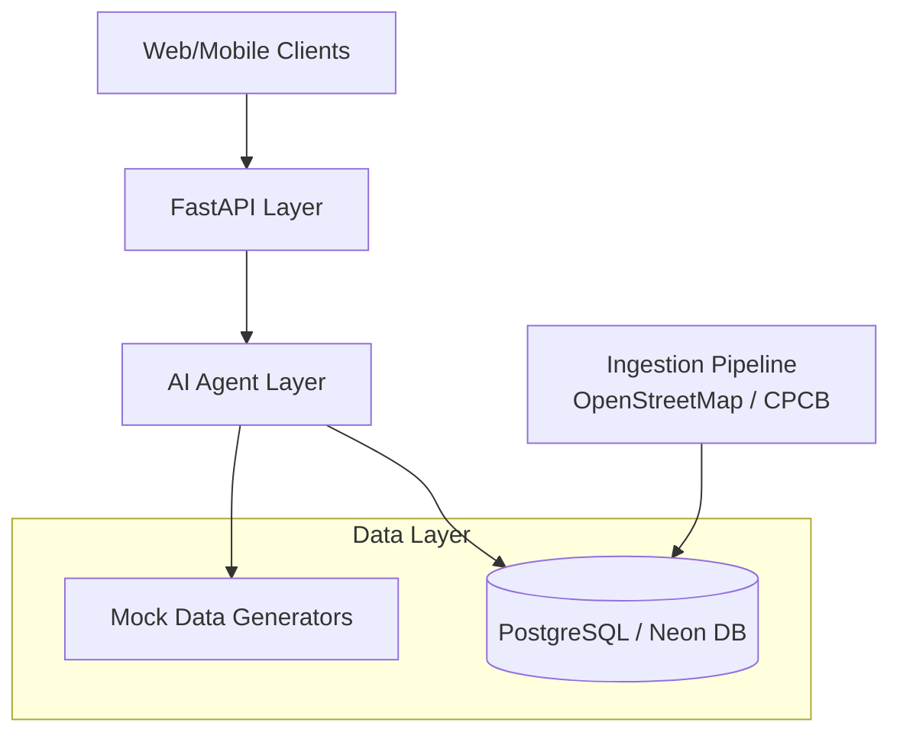
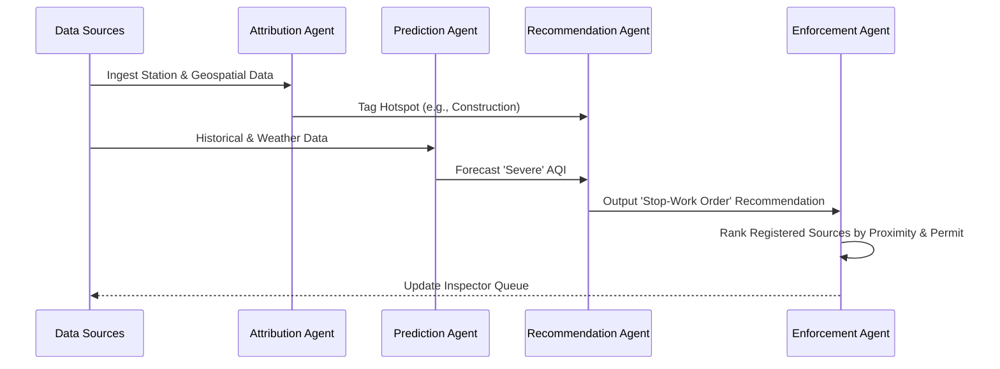

# ClearSkies System Design

This document outlines the architecture, data flow, and agent workflows of the ClearSkies multi-agent air quality management system. 

## 1. High-Level Architecture
ClearSkies is designed to provide actionable intelligence for city officials and citizens regarding air quality. The backend is built using a modern Python stack and follows a modular multi-agent architecture.

* **API Layer (FastAPI):** Exposes RESTful endpoints in `main.py` for the frontend dashboard and mobile apps. It acts as the orchestrator, receiving requests and dispatching them to the appropriate AI Agents.
* **Agent Layer:** A suite of specialized, decoupled Python classes (found in `agents/`) that each handle a specific domain of the air quality problem (e.g., forecasting, attribution, enforcement). Most agents are stateless and process data frames or dictionaries passed from the API layer.
* **Data Layer:** 
  * **Mock Data Generators (`data/mock_data.py`):** Currently used to simulate data for the hackathon/demo phase. 
  * **Real Database (`db/`):** A PostgreSQL database (hosted on Neon) accessed via SQLAlchemy raw SQL queries (`repository.py`). 
* **Ingestion Pipeline (`pipeline/`):** Scripts to pull external data, such as OpenStreetMap (Overpass) for land use and road network data.

## 2. Core Components & Agent Workflows

The system is divided into 12 distinct "Features", each powered by one or more agents.

### Forecasting & Analytics
* **Prediction Agent (`prediction_agent.py`):** Uses LightGBM (with a GradientBoostingRegressor fallback) to forecast AQI 24-72 hours into the future based on historical AQI, weather, and traffic data. It provides point estimates along with confidence bounds.
* **Trend Analysis Agent (`trend_agent.py`):** Analyzes historical AQI data to detect seasonal patterns, weekday vs. weekend effects, and festival-driven spikes using z-score anomaly detection.
* **Analytics Agent (`analytics_agent.py`):** Aggregates data across the system to provide dashboard summaries, including the ROI of past interventions (i.e., did closing a construction site actually lower the AQI?).
* **Multi-City Comparison Agent (`comparison_agent.py`):** Benchmarks different cities against each other based on average AQI and the effectiveness of their respective interventions.

### Action & Enforcement
* **Pollution Attribution Agent (`attribution_agent.py`):** Uses a RandomForest classifier to identify the *source* of a pollution hotspot (traffic, construction, industrial, dust, stubble burning) based on local geospatial features (e.g., stack counts, thermal anomalies).
* **Recommendation Agent (`recommendation_agent.py`):** A deterministic, rule-based engine that takes the attributed source and the forecast severity to output specific, role-based action recommendations (e.g., "Deploy water sprinklers within 2 hours").
* **Enforcement Prioritization Agent (`enforcement_agent.py`):** Ranks registered emission sources for inspection based on a composite score of proximity to hotspots, permit status, time since last inspection, and forecast severity.

### Monitoring & Citizen Engagement
* **Emergency Detection Agent (`emergency_agent.py`):** Monitors live station feeds using three triggers: rolling z-score spikes, rapid rate-of-change, and absolute severe thresholds.
* **Real-Time Alert Agent (`alert_agent.py`):** Decides if a situation warrants a push notification/SMS and formats the dispatch. It respects escalation paths (e.g., critical emergencies always trigger an SMS).
* **Citizen Advisory Agent (`advisory_agent.py`):** Generates personalized, multilingual health advisories based on the user's vulnerability profile (e.g., asthma, elderly) and the forecast AQI.
* **Chat Assistant Agent (`chat_agent.py`):** A lightweight RAG implementation using TF-IDF and cosine similarity to answer user queries using a curated knowledge corpus, optionally grounding answers in live ward data.
* **Heatmap Agent (`heatmap_agent.py`):** Uses Inverse Distance Weighting (IDW) interpolation to convert sparse station readings into a dense geospatial grid for map rendering.

## 3. Data Flow Example: The Enforcement Loop

1. **Ingestion:** Station readings and geospatial features (Overpass, NASA FIRMS) are ingested into the database.
2. **Attribution:** The `Attribution Agent` reads a hotspot's features and tags it with a likely source (e.g., "construction") and a confidence score.
3. **Forecasting:** The `Prediction Agent` calculates that the ward's AQI will hit the "Severe" band tomorrow.
4. **Recommendation:** The `Recommendation Agent` combines the "construction" attribution and "Severe" forecast to recommend a stop-work order.
5. **Prioritization:** The `Enforcement Agent` identifies a specific construction site near the hotspot with an expired permit and pushes it to the top of the inspector's queue.
6. **Outcome Tracking:** After the inspector logs the intervention, the system records the AQI before and after, feeding the `Analytics Agent` to calculate the intervention's ROI.

## 4. Scalability & Extensibility
* **Stateless Agents:** Because the agents themselves hold no state, they can be scaled horizontally behind the FastAPI workers.
* **Language Agnostic Prompts:** The `Advisory Agent` isolates its messaging templates into a dictionary, allowing new languages to be added without altering the code logic.
* **Model Swapping:** The architecture allows lightweight models (like TF-IDF or LightGBM) to be easily swapped for heavier embeddings or deep learning models in the future without changing the API contract.
